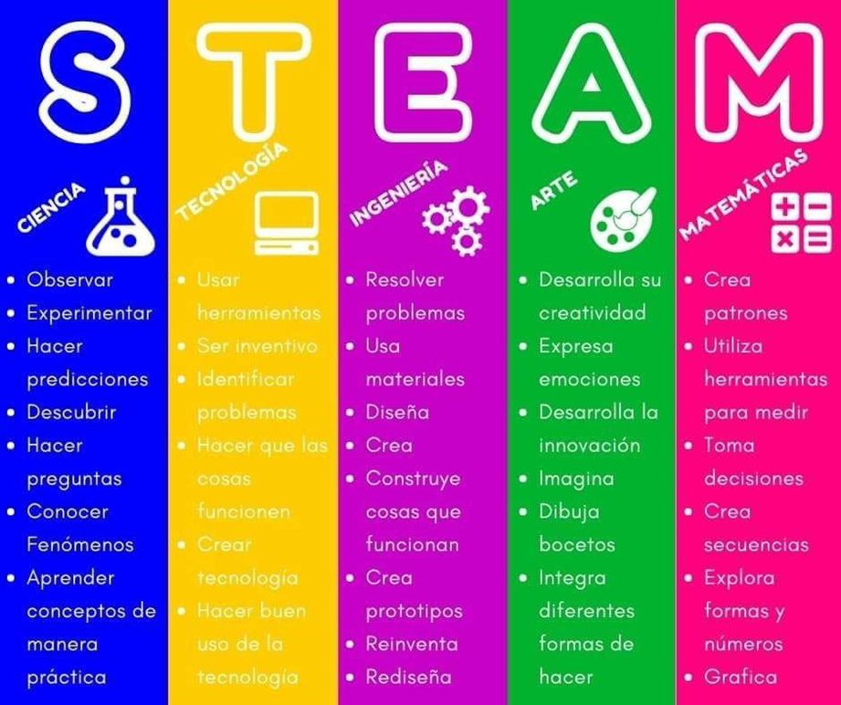
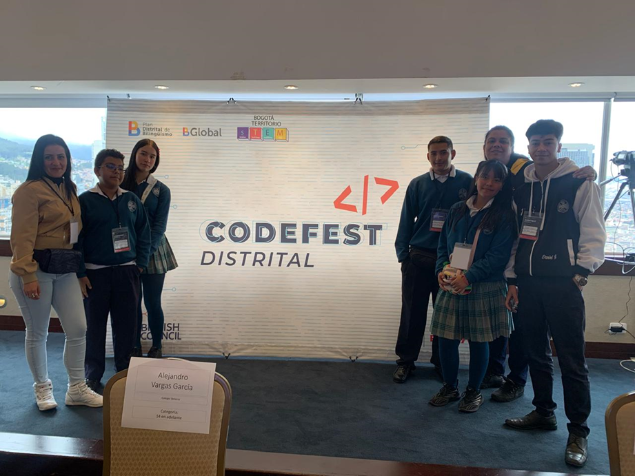
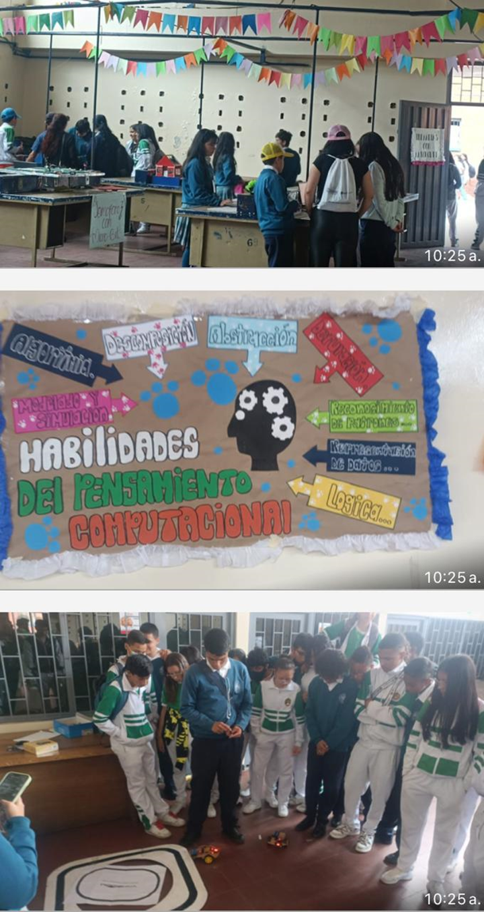
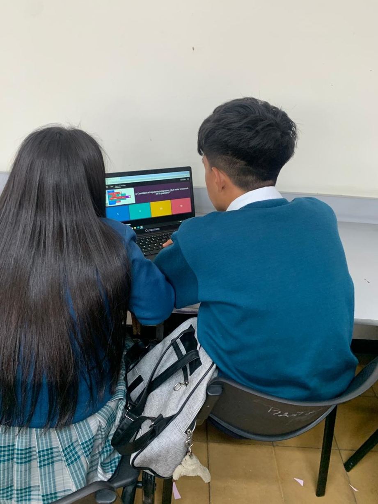
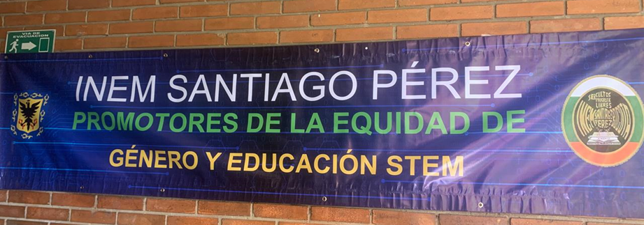
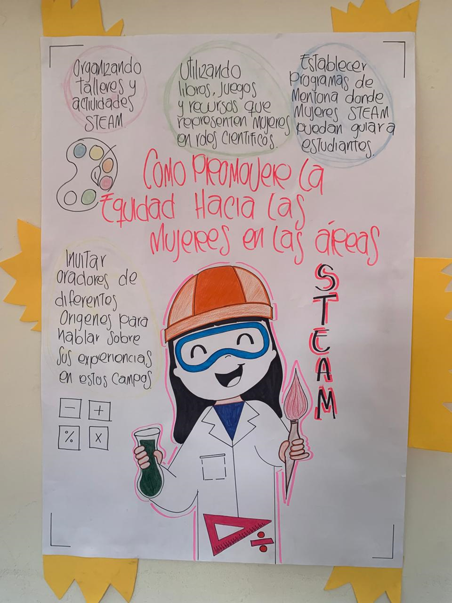

# ROBOEQUAL: ROMOVIENDO LA EQUIDAD DE GÉNERO Y LA ROBÓTICA EDUCATIVA.

Combinación de las palabras "robot" y "equal", enfatizando el objetivo de promover la equidad de género en el campo de la robótica. La palabra "innovación" para resaltar el enfoque en el desarrollo de soluciones creativas y vanguardistas.

## NUESTRO OBJETIVO:

Empoderar a niñas, niños y jóvenes mediante la educación en robótica, fomentando la equidad de género, promoviendo un entorno inclusivo y diverso en el ámbito de las áreas STEM
   

## NUESTROS PILARES

- Equidad: Promovemos un entorno de formación en el que se eliminen los estereotipos de género.
- Inclusión: Todas las voces son escuchadas y valoradas, respetamos y celebramos la diferencia
    
- Innovación: Estimulamos la creatividad y el pensamiento crítico, alentando a las y los jóvenes a desarrollar soluciones 
  tecnológicas innovadoras.
    
- Colaboración: Trabajamos juntos como una comunidad, compartiendo conocimientos y experiencias para crecer y aprender mutuamente.
  
- Empoderamiento: Capacitamos a niñas, niños y jóvenes para que se sientan seguros y capaces de perseguir sus intereses y aspiraciones.
  
  

   
 
